{fig-align="left" width="300"}

```{=html}
<script src="https://kit.fontawesome.com/ece750edd7.js" crossorigin="anonymous"></script>
```

# Bifx Live: Introduction To Snakemake

Snakemake is a powerful python based workflow management system, commonly
used to build bioinformatics analysis pipelines. This will demonstrate
how to run snakemake, why it is useful and introduce the key elements
needed to start writing your own workflows.

All that is needed to run snakemake is a 'Snakefile' and this command;

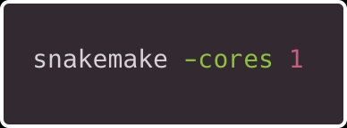{}

## Simple Demo

Let’s take making a cup of tea as a simplistic example, the order of the
steps is obviously important, we cant steep tea without boiled water.

Looking at an individual rule

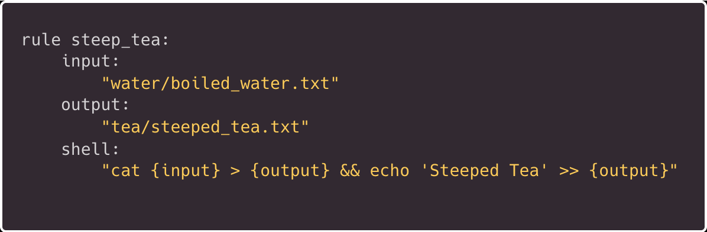

Let's look at the whole workflow;

``` bash
cat Snakefile
```

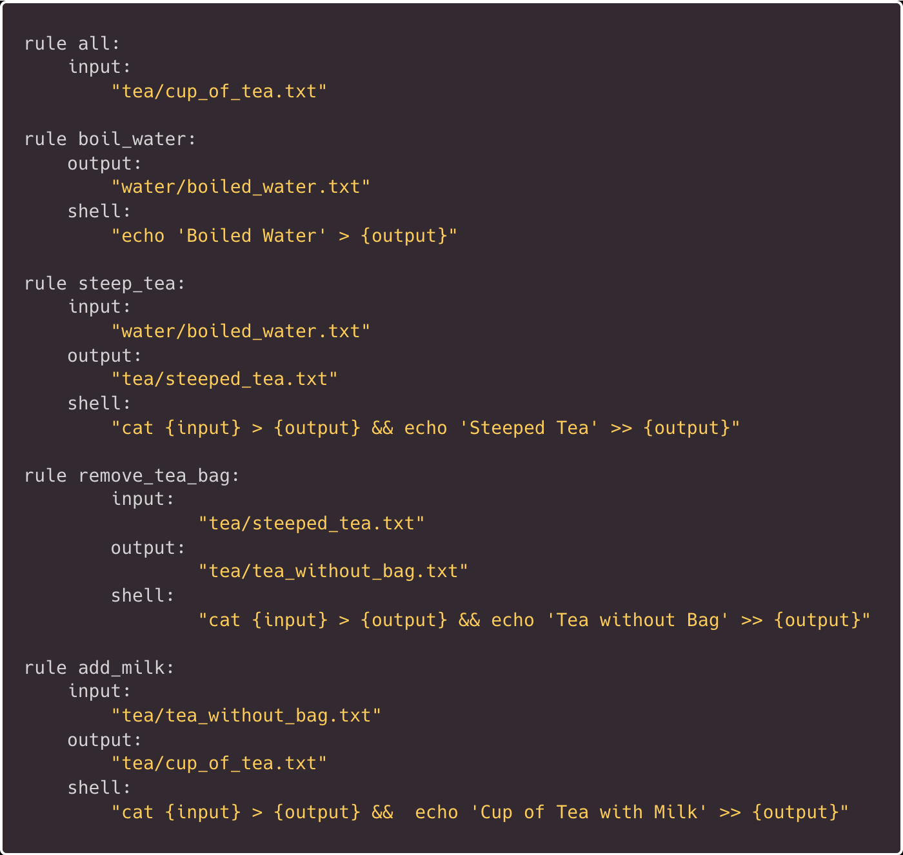

Snakemake needs a final target output, generally this is defined at the
very start of the workflow as rule all.

Before we run our first workflow, lets do a dry run (this is achieved by
adding the -n option)

``` bash
snakemake --cores 1 -np
```

--cores ‘Use at most N CPU cores/jobs in parallel’ (Remember, this is an
essential parameter)\
-p ‘Print the shell commands that will be run to terminal’\
-n ‘dry-run (do not execute)’\

This will print our commands but won't actually run anything

If everything looks okay, we are ready to run this in anger;

``` bash
snakemake --cores 1 -p
```

Hopefully we have created some new directories and files in sequence;

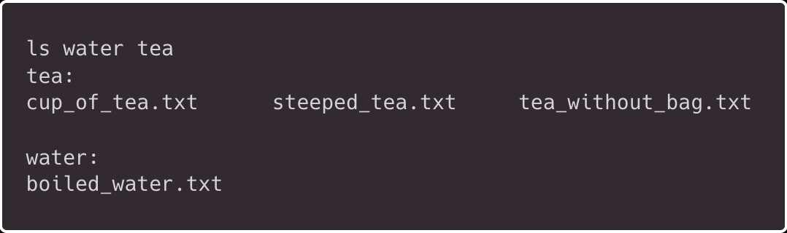

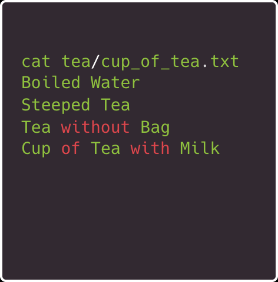

What happens if we run this workflow again?

"Nothing to be done (all requested files are present and up to date)."

This is because the final target (cup_of_tea.txt) already exists


We could force snakemake to re-run but lets play around with intermediate files and rules;

Lets manually remove our tea directory and its contents


``` bash
rm -r tea
```

Here we change the target so we only re-run a single rule;

``` bash
snakemake --cores 1 -p tea/steeped_tea.txt  
```

Or we could call the rule by name;
``` bash
snakemake --cores 1 -p steep_tea
```
Note if running this after previous command add the --force (-f) flag (as the file already exists)

Looking at the output, this only outputs the target file/rule output, but it doesn't run the first step as that already exists, this is useful as we don't repeat the early (potentially slow) steps.

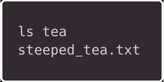

We can run any stage of the workflow we want by changing target or explicitly calling a rule.

If we now re-run our whole workflow, it will start from remove_tea_bag as it recognises steep_tea.txt exists and understands we have to remove the tea bag before adding milk! 

``` bash
snakemake --cores 1 -p 
```

A useful feature is to build a Directed Acyclic Graph (DAG), basically a
flow chart;

``` bash
snakemake --cores 1 -p --dag | dot -Tsvg > tea_dag.svg
```

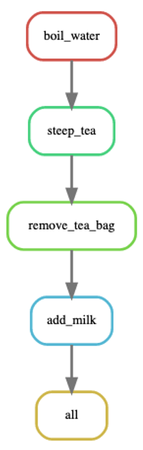

## Real World Demo

Here will we have a slightly more complex workflow using some real data
and tools (taken from the snakemake documentation). This performs read
mapping with some intermediate steps before performing variant calling
on multiple samples.\

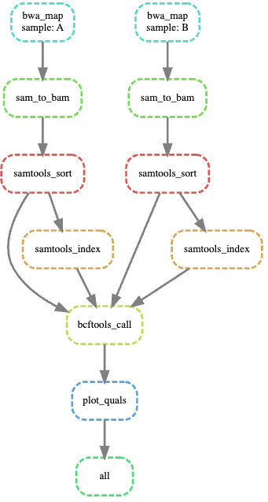

Lets take a look at this Snakefile, we can see we now have multiple samples and we are actually running tools, note the formatting
depends on the specific nature of that tool.

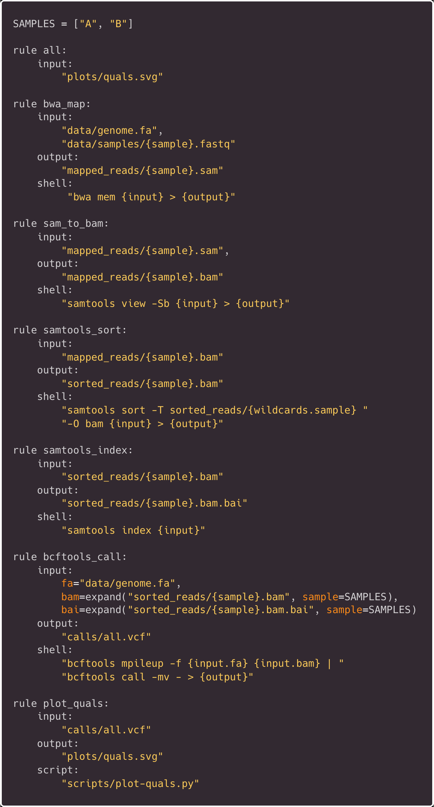

There is a lot of new things going on here;

* There are multiple inputs for some commands, 
 +  Wildcards is used to reference sample name only (within the shell)

 + The expand fuction allows us to reference multiple samples

 + bcftools inputs are labelled (fa/bam etc.) - this allows the fasta to be printed next to the -f flag

 + Piping outputs is still possible within a single rule

 + Rule plot_quals is calling a script rather than a tool via shell


Don't worry too much about these aspects for now, following this tutorial would make a good starting point if you want to
start learning how to make your own workflows

Lets run this new workflow, don't forget to do a dry run first (-n);

``` bash
snakemake --cores 1 -p
```

The final output is a plot from our script;
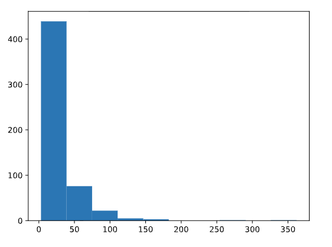
\ 

It shows the distribution of quality scores from our variant calls file.

## Best Practices

Generally its best practice to set variables inside a config file (config.yaml) rather
than inside the Snakefile itself e.g. setting software versions,
reference genomes or tool parameters. This can then be referenced by the Snakefile (configfile: "config.yaml"), this is
easier as workflows can become complex.

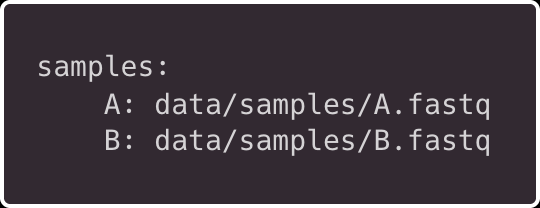

Also samples names can be set here but consider a separate samples file
for complex tables.

As mentioned, this more advanced example is taken from the snakemake
[documentation](https://snakemake.readthedocs.io/en/stable/tutorial/tutorial.html),
this is a good place to start before writing your own workflows, also as a
part of our [Autumn training](https://drp-hcb-bioinformatics.github.io/DRP-HCB-Bioinformatics/training.html)
 series, we will cover pipelines on the 8th of December, this will include snakemake.


## Setting up Snakemake


[Snakemake](https://snakemake.readthedocs.io/en/stable/getting_started/installation.html) recommends installing via Pixi/conda;

``` bash
pixi global install snakemake conda -c conda-forge -c bioconda
```

[Instructions for setting up tutorial](https://snakemake.readthedocs.io/en/stable/tutorial/setup.html)

``` bash
mkdir snakemake-tutorial
cd snakemake-tutorial

curl -L https://api.github.com/repos/snakemake/snakemake-tutorial-data/tarball -o snakemake-tutorial-data.tar.gz

tar -xf snakemake-tutorial-data.tar.gz --strip 1 "*/data" "*/environment.yaml"

pixi init --import environment.yaml
# type 'exit' to return to base shell
```

I  encourage you to build up the Snakefile incrementally starting with the [basics](https://snakemake.readthedocs.io/en/stable/tutorial/basics.html).

\
\

[Discovery Research Platform for Hidden Cell Biology](https://biology.ed.ac.uk/drp)
